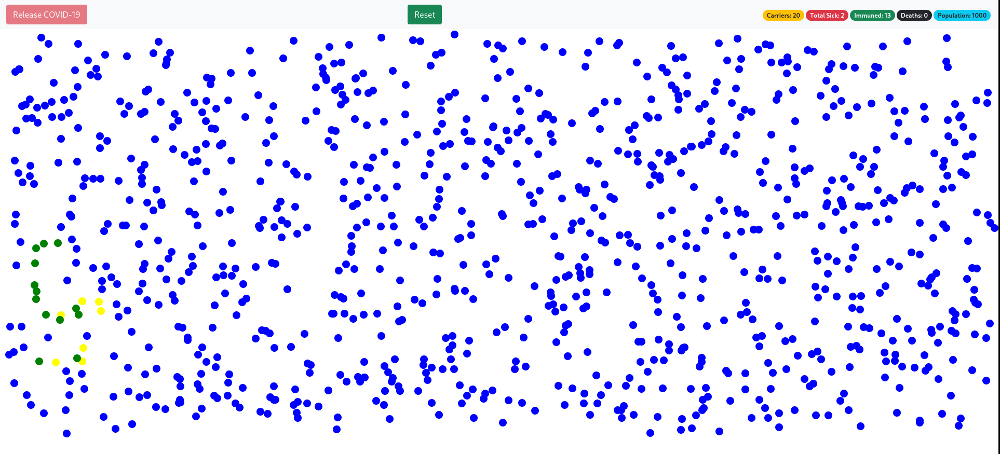

<h1 align="center">COVID Tracker</h1>

This project is a homemade COVID projector. Its very simple, using only one script and no CSS. The program simulates the spread of COVID. Each ball interacts with
eachother and changes color based on interaction. The pool starts off with 1000 balls. This program represents a population
  and then once a virus is added to the system it slowly spreads whenever a ball
  with covid comes in contact with a ball that has covid. After a collision a balls immunity 
  is increased but there is also a probability they could get sick or die. Once immunity reaches a
  threshold you can nolonger get sick but you can still spread the virus.

## Links

- [Repo](<https://github.com/naderhassan001/frontend-covidtracker> "<project-name> Repo")

- [Live](<http://covidtrackerfrontend.s3-website-us-east-1.amazonaws.com/> "Live View")

## Screenshots

## Options for Running the Program 

In the project directory, you have a few options.

You can open the index.html file in a web browser or with the extention "liver server" in VsCode or your favorite editor. 

## Built With

- JavaScript
- HTML

## Future Updates

- [ ] I want to see how easier it would be to use useSate in my project. My next update will involve updating the state of the balls. 
## Author

**Nader Hassan**

- [Profile](https://github.com/naderhassan001 "Nader Hassan")
- [Email](mailto:nader.hassan001@gmail.com "Hi!")

## 🤝 Support

Contributions, issues, and feature requests are welcome!

Give a ⭐️ if you like this project!
